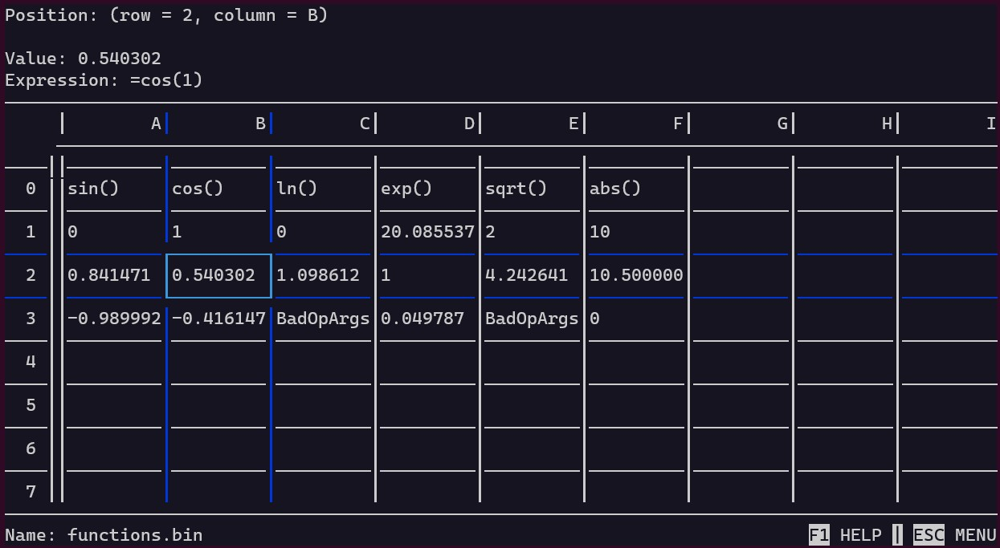
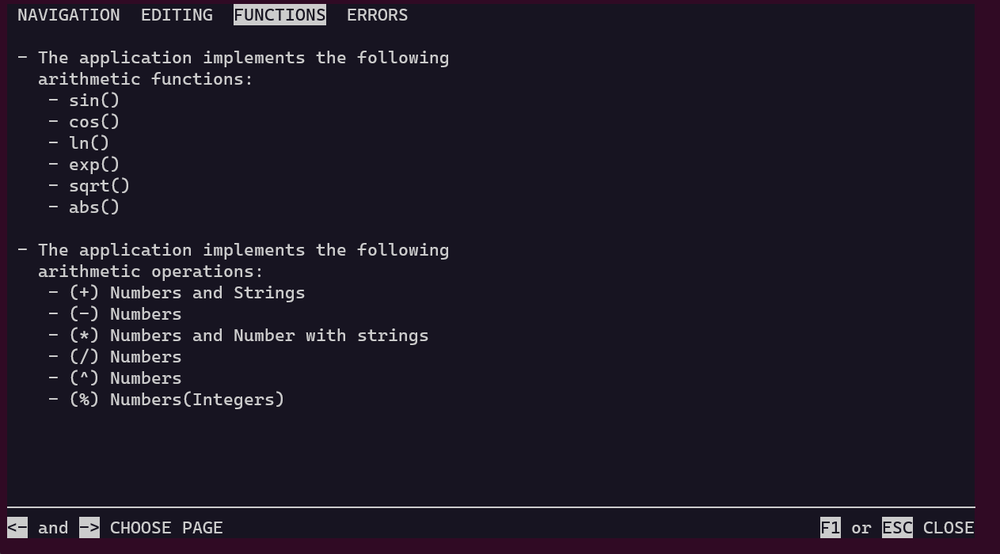
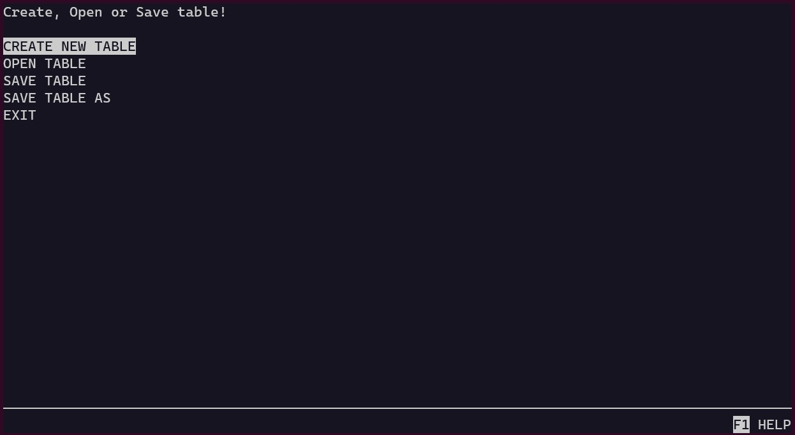

## Disclamer
This repository contains the code for the semester project of the subject [Programming and Algorithms 2](https://courses.fit.cvut.cz/BI-PA2/) studied during the second semester at the Czech Technical University in Prague.

The objective of the subject was to write code that works, covers all edge cases, and is efficient. There were also other rules, such as restrictions on the amount of memory our programs could use or a limited number of libraries we were allowed to use while writing the program.

# SpreadSheet Editor (Tabulkový editor)
The goal of the semester project was to create an interactive application, specifically a simple table editor.

## Requirements for the functionality:
The created table editor should:
- be able to work with numbers and strings;
- perform basic operations with numbers (addition, subtraction, multiplication, and division);
- implement basic operations with strings (concatenation, repetition);
- have at least three mathematical functions (sine, cosine, absolute value, square root);
- display tables, their resulting values, and formulas;
- be capable of saving the table to a readable file format and restoring the table's state from a file.

If a formula is written in a table cell, the resulting value should be updated when the cells referred to by the formula are updated. Additionally, prevention of circular references between cells should be implemented.

Expression processing will be implemented according to the following requirement:
All standard operations can be nested using parentheses, and parentheses can be arbitrarily nested, for example: 
```c++
(("w" * 3) + ".cvut.cz")
```

## Work examples:
### Table editor interface:


### Help Menu


### Main menu



## Comile and run:
- You should have ncurses installed (sudo apt-get install libncurses5-dev libncursesw5-dev);
- To generate the documentation, you need to have doxygen installed (sudo apt-get install doxygen);
- `make all` - Compile the application and generate documentation;
- `make run` - Launch the application;
- `make clean` - Removing all compiled files;